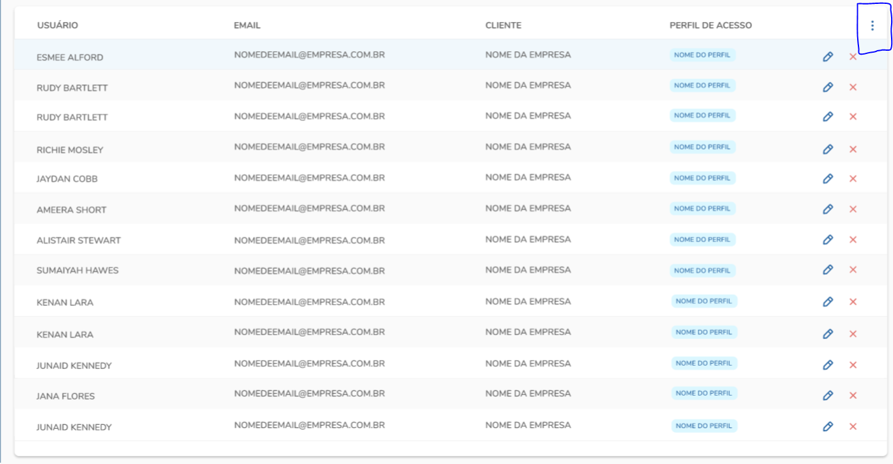
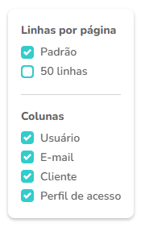

# Desafio Frontend

Projeto deve renderizar uma tabela contendo as colunas:  
→ Usuário  
→ Email  
→ Cliente  
→ Perfil de acesso  

Informações do usuário foram pegas da fake API `https://jsonplaceholder.typicode.com/` rota `/users`.

 

 
Tabela contém um menu no canto superior direito, ao ser clicado abre um card com as opções para acrescentar mais linhas ou ocultar alguma coluna da tabela.

 

